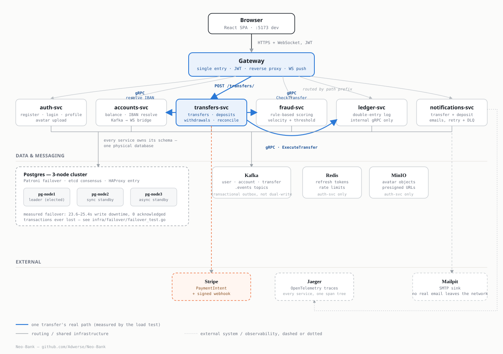
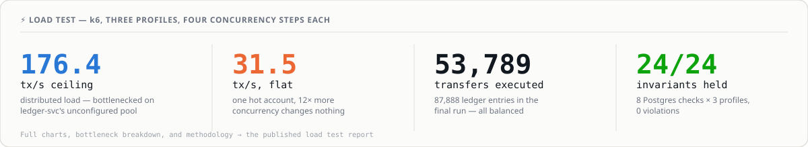

# 🏦 Neo-Bank

Register → fund with a test card → send money to someone else → watch both
balances update live, no reload. A neobank you run on your own laptop, built
to prove the ledger never lies — not when a Postgres node dies mid-transfer,
not when the same request arrives twice.

> 🎬 **Demo GIF — pending.** Recording instructions and the exact shot list
> are in [docs/screenshots/CHECKLIST.md](docs/screenshots/CHECKLIST.md).
> Until then, [DEMO.md](DEMO.md) is the same 5–10 minute walkthrough as a
> script you can run yourself.

[](https://github.com/Adwerse/Neo-Bank/actions/workflows/ci.yml)
[](go.work)
[](LICENSE)

📋 [Demo script](DEMO.md) · 📊 [Load test report](https://claude.ai/code/artifact/b40504bd-656e-452a-bb32-3e4ec344bd26) · 📖 [Full engineering log](spec.md) · 🎥 Video — recording soon

It's not a product — no real account, no transfer ever leaves the test
environment. It's an answer to seven concrete engineering questions, each
one answered with a measurement, not an assumption. See 🧠 below, or the
full story in [spec.md](spec.md).

---

## 🚀 Quick start

```bash
git clone https://github.com/Adwerse/Neo-Bank && cd Neo-Bank
cp .env.example .env
docker compose up -d
```

One command, 17 containers: 7 Go services + a 3-node Postgres cluster +
Kafka + Redis + MinIO + Jaeger + Mailpit. No Stripe key? Everything works
except `POST /deposits` — registration, transfers, fraud checks, the live
dashboard, even a Postgres failover. First build takes a few minutes; after
that, under one.

```bash
cd frontend && npm install && npm run dev   # → http://localhost:5173
```

Full requirements, port table, test commands, and the load test: [spec.md → Quick start](spec.md#quick-start).

---

## 🏗️ Architecture



*The blue path is one real transfer — everything else is routing and shared
infrastructure.* Async side, not pictured: `auth-svc`/`transfers-svc` write
to an outbox in the same Postgres transaction as the change; a relay
publishes to Kafka a second later.

| | service | owns | talks to |
|---|---|---|---|
| 🚪 | **gateway** | JWT, routing, WebSocket push | every service · Kafka |
| 🔐 | **auth-svc** | users, sessions, profile, avatars | Redis · MinIO · Kafka |
| 💳 | **accounts-svc** | accounts, IBAN resolve | ledger-svc (gRPC) · Kafka |
| 📒 | **ledger-svc** | the double-entry log — no public API | Postgres only |
| 💸 | **transfers-svc** | transfers, deposits, withdrawals, reconciliation | accounts/fraud/ledger-svc · Stripe · Kafka |
| 🕵️ | **fraud-svc** | rule-based transfer scoring | Postgres only |
| ✉️ | **notifications-svc** | transactional email | Kafka · Mailpit |

Each service has its own short README: [gateway](gateway/README.md) ·
[auth-svc](services/auth-svc/README.md) ·
[accounts-svc](services/accounts-svc/README.md) ·
[ledger-svc](services/ledger-svc/README.md) ·
[transfers-svc](services/transfers-svc/README.md) ·
[fraud-svc](services/fraud-svc/README.md) ·
[notifications-svc](services/notifications-svc/README.md).

---

## 🧠 What's actually interesting here

Seven problems a concurrency test, a failover test, or the load test forced
a real decision on. Each links straight to the code — not a paraphrase of
it. Full write-up on every row: [spec.md → Engineering highlights](spec.md#engineering-highlights).

| 🧩 the problem | 🛠️ the fix | 📍 code |
|---|---|---|
| Two transfers on one account race past "funds sufficient" | Row lock (`FOR UPDATE`), deterministic order, *before* the balance check | [`ledger.go:343`](services/ledger-svc/ledger.go#L343) |
| A deposit or Stripe refund can be delivered twice | `pg_advisory_xact_lock` per operation — 20 concurrent posts, 1 entry | [`ledger.go:530`](services/ledger-svc/ledger.go#L530) |
| A crash between "write" and "publish" drops or duplicates an event | Outbox: event + change in one transaction; a relay publishes after | [`outbox.go:84`](pkg/outbox/outbox.go#L84) |
| A gRPC call to the ledger succeeds but the response is lost | Stays `pending` — a worker asks the ledger directly, by reference | [`reconcile.go:90`](services/transfers-svc/reconcile.go#L90) |
| Stripe and the ledger can't share one transaction | Two statuses (`succeeded`→`credited`) + a reversal entry, never a delete | [`deposit_reconcile.go:66`](services/transfers-svc/deposit_reconcile.go#L66) |
| WebSocket delivery order isn't guaranteed | Push a signal only (`balance.changed`) — never the value itself | [`notify.go:55`](gateway/notify.go#L55) |
| The Postgres leader can die mid-transfer | Patroni + etcd, `synchronous_mode` — 0 tx lost across 4 real kills | [`patroni.yml:99`](infra/patroni/patroni.yml#L99) |

---

## 📊 Load test



251 Go test functions, run against a real Postgres — plus 8 database
invariant checks re-run after **every** load-test profile, because a load
test that only reads HTTP status codes can't tell a silent double-post from
a clean 201. Interactive charts, all four bottlenecks, methodology caveats:
**[the full report](https://claude.ai/code/artifact/b40504bd-656e-452a-bb32-3e4ec344bd26)**
or [spec.md → Load testing](spec.md#load-testing-k6--loadtest).

---

## ⚠️ Honest limitations

Things this project doesn't do — on purpose, not for lack of time. Full
reasoning for each: [spec.md → Honest limitations](spec.md#honest-limitations).

- 💸 **Withdrawals are simulated** — a real payout needs a money transmitter license, not more code.
- 🏛️ **The IBAN's bank code is fictional** (`ZZZZ`) — never points at a real institution.
- 🌍 **Transfers are intra-bank only** — no SEPA, and that's deliberate, not unfinished.
- 🙈 **No recipient name on confirmation** — the field doesn't exist in the system, so nothing can leak.
- 🪪 **No KYC** — email ownership only; identity verification is a different project.
- 🔑 **Refresh token lives in `localStorage`**, not an httpOnly cookie — a real, documented trade-off.
- 📧 **Exactly-once email is impossible** — a duplicate notification beats a silently missed one.
- 🚫 **Fail-closed when fraud-svc is down** — a transfer waits rather than skip the check.
- 🐌 **A hot account caps at 31.5 tx/s, flat** — the price of the row lock that keeps it from going negative.

---

## 📚 Go deeper

- **[spec.md](spec.md)** — the full engineering log: every sprint, every mini-ADR, every manual verification, sourced line-for-line from the real implementation.
- **[DEMO.md](DEMO.md)** — a 5–10 minute guided walkthrough, registration to Postgres failover.
- **[docs/architecture.svg](docs/architecture.svg)** · **[docs/screenshots/CHECKLIST.md](docs/screenshots/CHECKLIST.md)** — the diagram source and what's still pending to capture.

<sub>MIT licensed. Not a real bank — see ⚠️ above.</sub>
